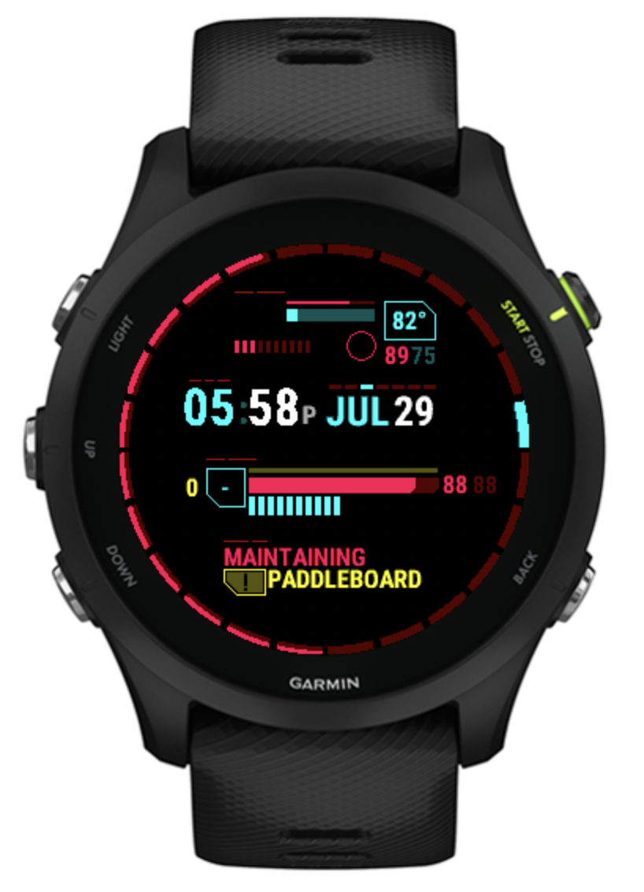

# Garmin Cyberpunk Watchface

I tend not to like the watch faces that display too much data. But the Cyberpunk aesthetic makes data overload look cool.
So to show all that data and make it look good, I'm recreating the UI in one of my favorite games Cyberpunk 2077's.
This watch features:
- an all encompassing weather widget that includes high and low temperature, weather, and chance of rain
- the Cyberpunk health bar reformatted to display body battery in red, step count in yellow, and heart rate slots in cyan
- your current task (today's suggested workout) and which mission (race) that task is for
- a decorative ring with 24 hour markers and indicators for sunrise, sunset, and moon phase

## TODO:

- [ ] Garmin dev ID
  - [ ] Move it into a better named folder in my `dev (/peter)` folder
  - [ ] Also store it on Google Docs incase I get a new laptop
- [ ] Start with the health bar
- [ ] Add a bunch of weather icons
- [ ] Install Rajdhani font and make the clockface first

- https://github.com/Remix-Design/RemixIcon
- https://lospec.com/palette-list/6-bit-rgb
- https://github.com/desyat/OpenWeatherMapWidget/tree/master/Open%20Weather%20Widget/resources/drawables
- https://github.com/sunpazed/garmin-iconfonts
- https://developer.garmin.com/connect-iq/connect-iq-basics/your-first-app/
- SDK Guide: https://developer.garmin.com/connect-iq/api-docs/Toybox/Time/Duration.html
- Tutorial: https://medium.com/@JoshuaTheMiller/making-a-watchface-for-garmin-devices-8c3ce28cae08
- 101: https://github.com/AndrewKhassapov/connect-iq 
- Garmin Dev: https://developer.garmin.com/connect-iq/monkey-c/
- Example: https://github.com/garmin/connectiq-apps/tree/master/watchfaces/DanceDanceGarmin