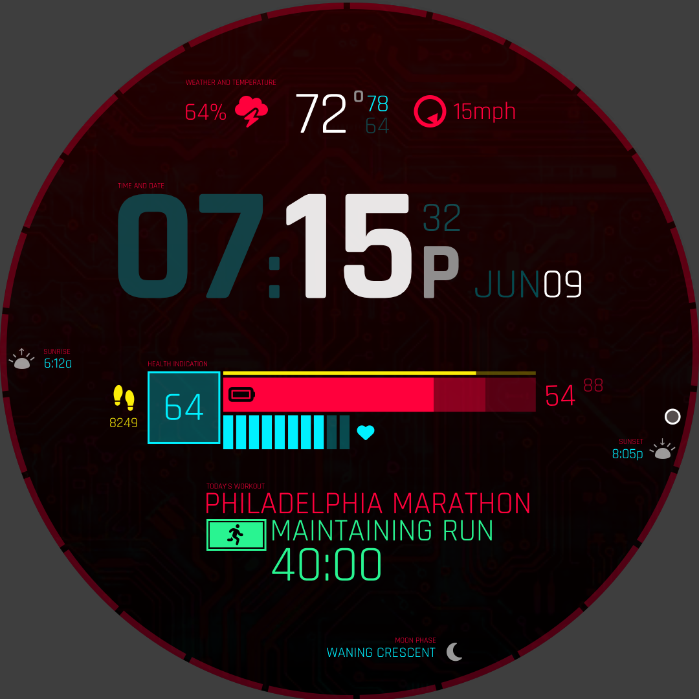

# Garmin Cyberpunk Watchface

I tend not to like the watch faces that display too much data. But the Cyberpunk aesthetic makes data overload look cool.
So to get that data overload and make it look good, I'm recreating the UI in one of my favorite games Cyberpunk 2077's.

## TODO:

- [ ] Garmin dev ID
  - [ ] Move it into a better named folder in my `dev (/peter)` folder
  - [ ] Also store it on Google Docs incase I get a new laptop
- [ ] Install Rajdhani font and make the clockface first

- Tutorial: https://medium.com/@JoshuaTheMiller/making-a-watchface-for-garmin-devices-8c3ce28cae08
- 101: https://github.com/AndrewKhassapov/connect-iq 